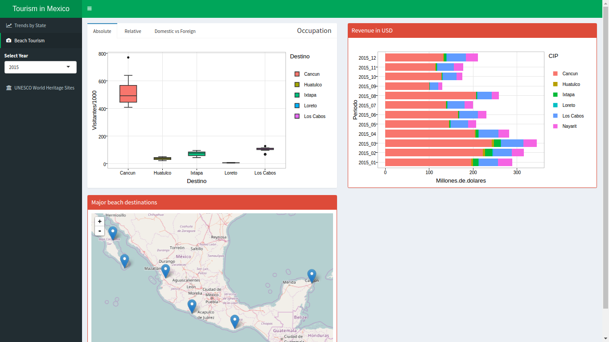
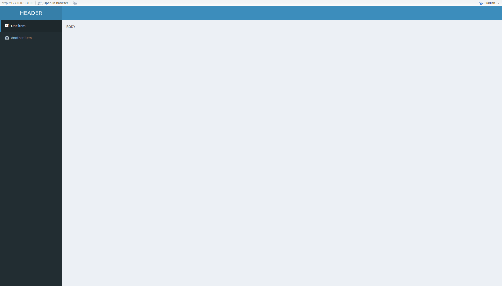

```{r setup, include=FALSE}
knitr::opts_chunk$set(echo = FALSE)
```

## Shinydashboard package

We willl use the [shinydashboard](https://rstudio.github.io/shinydashboard/get_started.html) library, that offers a very nice layout for creating dashboards.

```{r,echo=T}
# install.packages("shinydashboard")
library(shiny)
library(shinydashboard)

```

## Wireframes

- Essential for clarifying the task!
- "If you don't know where you are going, any road will get you there" 

## Our goal (minus the map):


## How to get there?

Some diagram about front end backend, etc

## Building blocks of our UI
 
```{r, eval =F, echo=TRUE}
# ui.R
library(shiny)
library(shinydashboard)

dashboardPage(
  dashboardHeader(title="HEADER"),
  dashboardSidebar("SIDEBAR"),
  dashboardBody("BODY")
)

```


## Output


## Customizing the sidebar  

We can customize the sidebar a bit:

```{r, eval =F, echo=TRUE}
# ui.R
library(shiny)
library(shinydashboard)

  dashboardHeader(title="HEADER"),
  dashboardSidebar(
    sidebarMenu(
      menuItem("One item", tabName = "tab1", icon=icon("archive")), 
      menuItem("Another item", tabName = "tab2", 
               icon=icon("camera", "glyphicon"))  
    )
    
  ),
  dashboardBody("BODY")
)

```

## 



Check `?dashboardSidebar` for more options.

## Binding UI with server logic

Graphic elements in the user interface are connected to server logic as follows:

- On server side, renderX functions
- On ui side, XOutput functions

For instance, `renderPlot` vs `plotOutput`, `renderUI` vs `uiOutput`, etc.

## Drafting our first plot

It's good idea to draft the first plot on a new script before plugging it into the app.

```{r, eval=F, echo=TRUE}

    act_df <- read.csv("tourist_activity.csv")

    gg <-   act_df %>% 
            filter(grepl('2016', Periodo)) %>%
            ggplot(aes(x=Destino, y=Visitantes/1000, 
                       fill = Destino))+
            geom_boxplot()+theme_bw()
          
    ggplotly(gg)  

```


## Into the app

Once we are happy, we can plug it in the result!

```{r, eval=F, echo=T}
#ui.R
library(shiny)
library(shinydashboard)
dashboardPage(
  dashboardHeader(title="HEADER"),
  dashboardSidebar(
    sidebarMenu(
      menuItem("One item", tabName = "tab1", icon=icon("archive")), 
      menuItem("Another item", tabName = "tab2", 
               icon=icon("camera", "glyphicon")),
      , selectInput("year", "Select year", 
                    choices = c("2016","2015"), selected = "2016")
    )
  ),
  dashboardBody(plotlyOutput("bpDV"))
)

```


## On the server side:

```{r, echo=T, eval=F}
#server.R

shinyServer(function(input, output) {
  
    output$bpDV <- renderPlotly({
      gg <-   act_df %>% 
            filter(grepl(input$year, Periodo)) %>%
            ggplot(aes(x=Destino, y=Visitantes/1000, 
                       fill = Destino))+
            geom_boxplot()+theme_bw()
          
    ggplotly(gg)  
  })
}


```


## Single-file app

On smaller apps, like this, we can even fit everything on a single `app.R` file:

```{r, eval=F, echo=F}

library(shiny)
library(shinydashboard)

ui <- dashboardPage(
  dashboardHeader(title="HEADER"),
  dashboardSidebar(
    sidebarMenu(
      menuItem("One item", tabName = "tab1", icon=icon("archive")), 
      menuItem("Another item", tabName = "tab2", icon=icon("camera", "glyphicon")),
      selectInput("year", "Select year", 
                    choices = c("2016","2015","2014","2013"), selected = "2016")
    )
    
  ),
  dashboardBody(
    tabItems(
      
      tabItem(tabName = "tab1"
              
      )
      
      , tabItem(tabName = "tab2", 
                fluidRow(
                  tabBox(
                    title = "Occupation"
                    , tabPanel("Absolute"
                               #,plotlyOutput("bpDV")
                               )
                    , tabPanel("Relative"
                               #,plotlyOutput("pctChart")
                               )
                    , tabPanel("Domestic vs Foreign"
                               #, plotlyOutput("barPlots")
                               )
                  )
                  , 
                  box(status="danger",solidHeader = T,
                      title = "Revenue in USD" 
                  )
                  
                  , box(status = "danger",  solidHeader = T, title = "Occupation by State")
                )
                
      )
      
    )  
  )
)

server <- function(input, output) { }

shinyApp(ui, server)

```


## Exercise: 

Given the basic layout, try to replicate the structure of the wireframes.

## Reactive expressions

One important concept in Shiny apps is that of **reactive** expressions: 

From Shiny's documentation:

- A reactive expression saves its result the first time you run it.

- The next time the reactive expression is called, it checks if the saved value has become out of date (i.e., whether the widgets it depends on have changed).

- If the value is out of date, the reactive object will recalculate it (and then save the new result).

- If the value is up-to-date, the reactive expression will return the saved value without doing any computation.


## Example

Instead of calculating `act_df %>% filter(grepl(input$year, Periodo))` for every plot, we hide it away on a reactive expression:

```{r, echo=T, eval=F}
#server.R
  activity <- reactive({
    act_df %>% 
      filter(grepl(input$year, Periodo))
  })


```


## 

when we need it, we can call it as a function:

```{r, echo=TRUE, eval=F}
  output$bpDV <- renderPlotly({
    gg <- activity()%>%
      ggplot(aes(x=Destino, y=Visitantes/1000, fill = Destino))+
      geom_boxplot()+theme_bw()
    
    ggplotly(gg)  
  })
  

```


## Why are reactive expressions useful?

- Factor the code and make it more organized (not the most important use case).
- Speed up performance of the app by recalculating only what is *truly* needed (meaning that it changed).
- Reduces, in more complicated apps, unnecessary calls to the database or to external APIs.